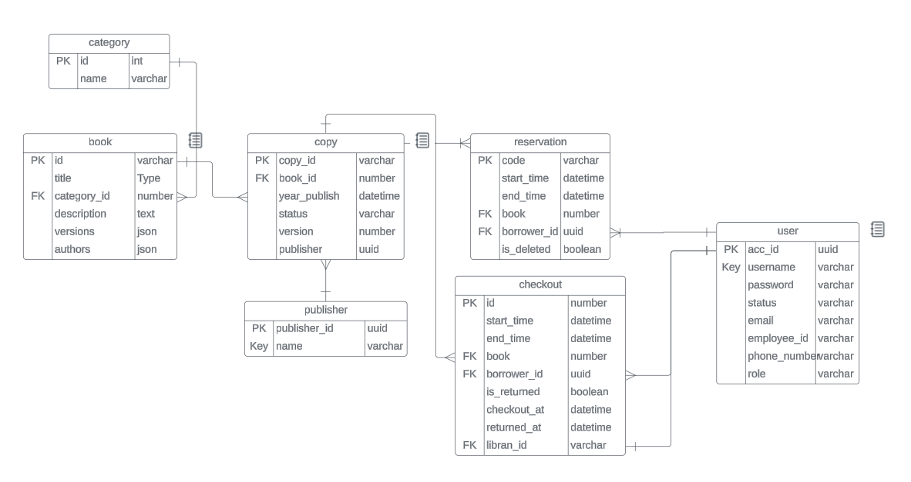

# Book reservation - DBMS asm


diagram:  [link](https://lucid.app/lucidchart/6c6b26b2-c1ae-44f0-b084-ff430e2fcd1d/edit?viewport_loc=339%2C-547%2C2464%2C1368%2C0_0&invitationId=inv_0a750fe7-3c33-4dd9-8c8e-3db5e0cecb93>) 
# Usage
## Start the web server
### Configure server 
== Important ==
Create an application.yml 
in `src/main/resources/` package according to the example file named `application-example.yml` in the same package

Mac/Ubuntu
```bash
gradle bootRun
```

Window
```bash
gradlew bootRun
```

## Perform changes on database
Create new file with naming convention `V[x]__[filename].sql`
whereas [x] is the version number and [filename] is file name. The version number
must be greater than the last version number. And there is no restriction on the filename.
